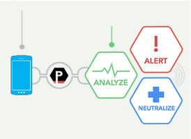
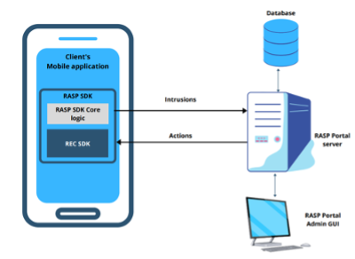

<h1 align=center>

</h1>

# 🔒 App Protector: Freemium RASP Solution
App Protector is a Runtime Application Self-Protection (RASP) solution developed by ASEE, designed to elevate mobile app security. Strengthen your defenses against emerging threats without compromising user experience.

We have created a freemium SDK so that you can try our solution.

# 📖 Table of Contents
- [Overview](#overview) 
- [RASP Features](#rasp-features)
- [Full RASP Features (iOS)](#full-rasp-features-ios)
- [Getting Started](#getting-started)
  - [Android Installation](#android-installation)
  - [iOS Installation](#ios-installation)
- [Data Collection and Privacy](#data-collection-and-privacy)
- [Freemium vs. Premium Model](#freemium-vs-premium-model)
- [Community Contributions](#community-contributions) 
- [About Us](#about-us)
- [License](#license) 

# 🌐 Overview
RASP is a technology that is embedded within application and kicks in when an application starts and runs. It's designed to detect attacks on an application runtime. When an application begins to run, RASP can protect it from malicious input or behaviour by analysing both, the app's behaviour, and the context of that behaviour. By using the application to continuously monitor its own behaviour, attacks can be identified and mitigated immediately without human intervention.

<h1 align=center>

</h1>

### 🔑 Key Features

- **Proactive Threat Detection:** Detect and react to security events during application runtime with configurable incident response features.
- **Collecting Security Events:** Integrate RASP to collect security events on the server side, providing insights into detected security events.
- **Security Events Visibility:** App Protector Portal SDK offers real-time information about detected security events, aiding in monitoring and quick reactions.
- **PSD2 Compliance:** Meet regulatory requirements for mobile applications handling payment transactions with self-protecting data.
- **Minimal Performance Impact:** Smooth implementation with no downtime, source code changes, false positives, or performance overhead.

### App Protector Portal
App Protector portal is only available with the full App Protector version.

Android App Protector SDK is written in Java language but is fully compatible with other Java languages supported on Android, like Kotlin. This framework can be used for target devices from Android KitKat (API level 19) and higher.

For iOS, there are two builds, build for SWIFT and build for Objective-C. Both versions have all the capabilities in terms of runtime self-protection. This framework can be used for target devices from iOS 8.0 and higher.

App Protector SDK collects and sends security events from mobile applications to App Protector Portal. Portal can be used for analysing security events/attacks on user’s devices which have installed monitored production application. Based on received information, behaviour of App Protector (RASP configuration) can be changed. Changing configuration or responses on attacks can be done by sending change information over App Protector Portal server to App Protector SDK on mobile device.

App Protector Portal is a solution that enables clients to create RASP configuration for each user and mobile application. Using this solution, clients will be able to set which attack App Protector SDK online should detect and choose which response will be created after attack is detected. App Protector SDK online collects data of detected attacks and sends it to Portal. Based on the inputs from the SDK, client will be able to see statistics for each platform, Android and iOS.

For more information, please [Contact Us](https://cybersecurity.asee.io/contact-us/).

<h1 align=center>

</h1>

# 🔍 RASP Features
## Jailbreak/Root Detection
- Identifies rooted or jailbroken devices.

## Code Signature Integrity
- Verifies the integrity of your app's signature.
- Ensures the authenticity of the app package.

## App Store Validation
- Flags installations from untrusted sources or unofficial stores.

# 📱 Full RASP Features (iOS)
## Advanced Jailbreak/Root Detection
- Enhanced detection for advanced jailbreak and root exploits.
- Compatibility with Magisk and other sophisticated techniques.
- Supports various exploits, including unc0ver and checkra1n.

## Debugging Mode Detection
- Identifies when the app is running in debugging mode.

## Hooking Framework Identification
- Detects hooking frameworks like Frida, Xposed, and Shadow.

## Simulator/Emulator Check
- Flags if the app is running in a simulator or emulator environment.

## Screen Recording Defense
- Guards against unauthorized screen recording attempts on iOS Devices.

## Obfuscation
- Component that is responsible for obfuscation of application code and strings to improve the application resilience to static reverse engineering.

## App integrity check
- Detects malicious modifications of iOS and Android mobile applications

# 🚀 Installation Guide
Follow the guides below to seamlessly integrate Freemium App Protector into your Android and iOS applications.

## Android Installation
[Not available yet.]

## iOS Installation
[Link to iOS Installation Guide](https://github.com/assecosee/see.asee.ios.FreemiumAppProtector)

## 🛡️ Data Collection and Privacy
Freemium App Protector doesn't collect anonymized security diagnostics data for app and device instances.

# 💎 Freemium vs. Premium Model 
Explore our premium plan for additional features and unparalleled security.

<table>
  <thead>
    <tr>
      <th></th>
      <th>Free SDK</th>
      <th>Full SDK</th>
    </tr>
  </thead>
  <tbody>
    <tr>
      <td><strong>Jailbreak/Root Detection</strong></td>
      <td>✓</td>
      <td>✓</td>
    </tr>
    <tr>
      <td><strong>App Signature Integrity</strong></td>
      <td>✓</td>
      <td>❌ (on request) </td>
    </tr>
    <tr>
      <td><strong>App Store Validation</strong></td>
      <td>✓</td>
      <td>❌ (on request)</td>
    </tr>
    <tr>
      <td><strong>Debugging Mode Detection</strong></td>
      <td>❌</td>
      <td>✓</td>
    </tr>
    <tr>
      <td><strong>Hooking Framework Identification</strong></td>
      <td>❌</td>
      <td>✓</td>
    </tr>
    <tr>
      <td><strong>Simulator/Emulator Check</strong></td>
      <td>❌</td>
      <td>✓</td>
    </tr>
    <tr>
      <td><strong>Screen Recording Defense (only iOS)</strong></td>
      <td>❌</td>
      <td>✓</td>
    </tr>
    <tr>
      <td><strong>Obfuscation</strong></td>
      <td>❌</td>
      <td>✓</td>
    </tr>
    <tr>
      <td><strong>App Integrity Check</strong></td>
      <td>❌</td>
      <td>✓</td>
    </tr>
    <tr>
      <td><strong>Web Portal</strong></td>
      <td>❌</td>
      <td>✓</td>
    </tr>
  </tbody>
</table>

# 🤝 Community Contributions
Join our community and contribute to the ongoing development of App Protector. Whether it's filing issues, addressing existing ones, or enhancing our documentation, your contributions are appreciated.

# ℹ️ About Us
ASEE group is one of the biggest IT companies in the area of production and implementation of its own software solutions and services in the region of South Eastern Europe, Turkey, Spain, Portugal, Andorra, Colombia, Peru and the Dominican Republic.

ASEE provides products and services within the Payment business under Payten name. Since October 2009, the shares of Asseco South Eastern Europe (WSE: ASSECO SEE, ASE) have been listed on the Warsaw Stock Exchange.

# 📜 License
Freemium App Protector SDK is provided under a freemium model. Review the [LICENSE](https://github.com/assecosee/see.asee.FreemiumAppProtector/blob/main/LICENSE) for detailed information.
